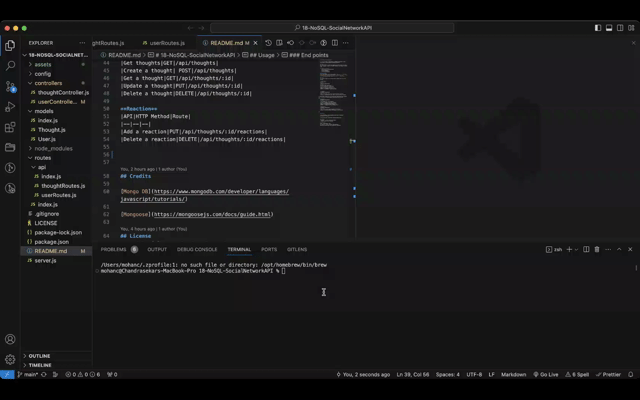

# 18-NoSQL-SocialNetworkAPI

[](http://choosealicense.com/licenses/mit/)

## Description
API for a social network web application where users can share their thoughts, react to friends’ thoughts, and create a friend list

## Table of Contents
 - [Installation](#installation)
 - [Usage](#usage)
 - [Credits](#credits)
 - [License](#license)

## Installation
Clone the github repo as shown below, 

``` git clone git@github.com:chandraucb/18-NoSQL-SocialNetworkAPI.git ```

Run node package install

``` npm install ```

## Usage
To run this application execute below command and follow the prompts 

```npm start ``` 

Demo video to show how to start the application,


### End points
**User**
|API|HTTP Method|Route|
|--|--|--|
|Get Users|GET |/api/users|
|Create a user|POST |/api/users|
|Get a user|GET |/api/users/:id|
|Update a user|PUT |/api/users/:id|
|Delete a user|DELETE |/api/users/:id|

Video demo to show how above routes respond,

    
**Friend**
|API|HTTP Method|Route|
|--|--|--|
|Add a friend|PUT|/api/users/:userId/friends/:friendId|
|Delete a friend|DELETE|/api/users/:userId/friends/:friendId|

Demo Video showing user routes for adding/deleting friends,
 

**Thought**
|API|HTTP Method|Route|
|--|--|--|
|Get thoughts|GET|/api/thoughts|
|Create a thought| POST|/api/thoughts|
|Get a thought|GET|/api/thoughts/:id|
|Update a thought|PUT|/api/thoughts/:id|
|Delete a thought|DELETE|/api/thoughts/:id|

Video demo to show how above thought routes respond,


**Reaction**
|API|HTTP Method|Route|
|--|--|--|
|Add a reaction|PUT|/api/thoughts/:id/reactions|
|Delete a reaction|DELETE|/api/thoughts/:id/reactions|

Video demo to show how above routes respond,


Demo video for bonus delete user scenario,
 


## Credits

[Mongo DB](https://www.mongodb.com/developer/languages/javascript/tutorials/)

[Mongoose](https://mongoosejs.com/docs/guide.html)

## License
Copyright (c) 2023 Chandrasekar Mohan
Licensed under the MIT License

## Questions 
Name : Chandrasekar Mohan 
Git profile : https://github.com/chandraucb 
Reach me through email with additional questions

